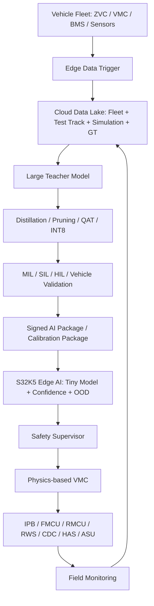
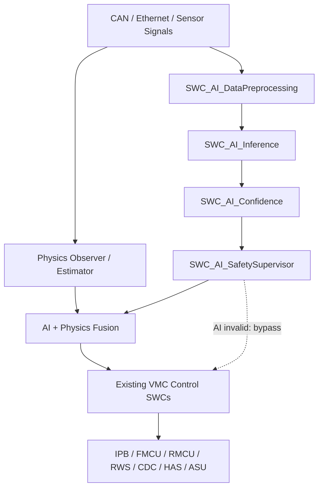

# VMC Edge AI 与云边协同智能平台方案

**适用项目：** Tri-motor 800V BEV / ZVC-based VMC  
**目标控制器：** NXP S32K5  
**版本：** V1.0  
**日期：** 2026-09-24

> 本文档面向 VMC/底盘控制团队，目标是在不破坏现有物理模型、功能安全和实时闭环确定性的前提下，引入小参数 Edge AI，并通过云端大模型/大参数 Teacher 持续训练、蒸馏和版本化下发，形成可持续演进的 Cloud-Edge AI 平台。

## 1. Executive Summary

当前 ZVC 平台采用 NXP S32K5。NXP 公开资料显示，S32K5 面向汽车 Zone/Chassis/Safety 控制场景，集成 eIQ Neutron NPU，并支持 eIQ Auto ML 工具链、ONNX/LiteRT 等部署路径；NXP 也已经公开展示了将 INT8 虚拟传感器模型部署到 S32K5/R52 环境的案例。[1][2][3]

对 VMC 而言，Edge AI 最有价值的切入点不是直接取代 TV、RWS、制动或主动悬架控制器，而是补强传统算法最难处理的三类问题：

1. **难建模状态估计：** μ、β、Vy、Fx/Fy/Fz、路面类型等；
2. **慢变化参数辨识：** Cf/Cr、轮胎/悬架/执行器老化、车辆载荷等；
3. **跨车队学习问题：** Predictive Maintenance、驾驶风格、能耗/热管理、异常数据挖掘。

推荐总体技术路线为：

> **Physics-based Control + Edge AI Enhancement + Cloud Teacher + Safety Supervisor**

其中，云端负责复杂模型训练、车队数据学习、Teacher Model 和模型压缩；S32K5 端侧负责高频、小模型、低时延推理；最终控制权仍由可解释、可验证的 VMC 物理控制器掌握。

## 2. Platform Architecture



### 2.1 核心原则

- **AI 不作为单点控制权。** 对制动、驱动扭矩、RWS、主动悬架等安全关键闭环，AI 优先输出状态、参数、残差、分类或置信度。
- **Physics First。** 当 AI 不可用、OOD、置信度过低或违反物理边界时，系统立即回退到现有 Observer/Estimator/Controller。
- **Residual Learning 优先。** 比如 `β_final = β_physics + Δβ_AI`，而不是直接让 NN 端到端输出 β 并替换 Observer。
- **云端重训练、端侧轻推理。** 大模型只作为 Teacher 或分析模型，不直接部署到 ZVC。
- **模型更新必须版本化和验证。** Safety-critical AI 不采用未经验证的在线自学习直接修改控制模型。

## 3. Recommended Edge AI Use Cases

| # | Use Case | Edge AI Output | VMC / Vehicle Value | Suggested Model | Value | Phase |
|---|---|---|---|---|---|---|
| 1 | AI Road Friction / Surface Estimation | μ、分轮 μ、Road Class、Confidence | Wheel Slip / TCS / TV / Max Lat Acc / Brake Vectoring | TCN / GRU / Small MLP | 高 | 首批 PoC |
| 2 | AI Tire Force / Wheel Load Virtual Sensor | Fx/Fy/Fz、Cf/Cr 或残差修正 | TV / RWS / β 估计 / Tire Utilization | MLP / TCN | 高 | 首批 PoC |
| 3 | AI Enhanced β / Vy Observer | Δβ、ΔVy、Confidence | Stability / TV / Target Vehicle Model | MLP / GRU / TCN | 高 | 首批 PoC |
| 4 | Intelligent Suspension / Road Estimator | Roughness、Road Frequency、Bump/Pothole、Road Profile | CDC / HAS / Ride Comfort / Wheel Motion | 1D CNN / TCN | 中高 | 第二阶段 |
| 5 | Driver DNA / Dynamics Personalization | Driver Style、Preference Embedding | Target Vehicle Model / RWS-TV split / Damping | GRU / MLP | 中 | 第二阶段 |
| 6 | Chassis Predictive Maintenance | Health Score、Anomaly Score、RUL | CDC/HAS/RWS/EPS/IPB/Motor 健康监测 | Autoencoder / TCN / LSTM | 高 | 第二阶段 |
| 7 | Energy / Thermal Edge AI | Efficiency Correction、Thermal Prediction、SOP/SOC 辅助 | 三电机扭矩分配 / 热管理 / 能耗 | MLP / TCN / GRU | 中高 | 跨域扩展 |
| 8 | Fleet Intelligent Data Trigger | Event / Novelty / Anomaly Score | 触发数据记录和上传，构建持续学习数据闭环 | Autoencoder / Tiny MLP | 很高 | 平台基础能力 |

## 4. Use Case 1 — AI Road Friction / Surface Estimator

### 4.1 Purpose

传统 μ 估算在低激励、路面突变、Combined Slip、轮胎温度/磨损变化时容易出现收敛慢或模型偏差。Edge AI 可学习复杂时序关系，作为现有 μ Observer 的增强层。

### 4.2 Candidate Inputs

- Vehicle speed / wheel speeds / slip ratio
- Steering angle / steering rate
- Yaw rate / ax / ay
- Front motor torque + rear-left/right motor torque
- Four-wheel brake pressure / brake torque estimation
- Four-wheel Fz estimation
- Road slope / drive mode / ESC-TCS states
- 可选：轮胎温度、环境温度、雨量/摄像头道路信息

### 4.3 Outputs

- `mu_est`、`mu_FL/FR/RL/RR`（视数据可观测性逐步开放）
- Road class: Dry / Wet / Snow / Ice / Gravel / Mud / Sand
- Confidence / OOD score

### 4.4 Integration

```text
mu_final = Saturation(mu_physics + W_conf * delta_mu_AI)
```

AI 输出可进一步服务 Wheel Slip Target、Traction、eTV、Maximize Lateral Acc、Launch、Brake Vectoring、All Terrain 等。

## 5. Use Case 2 — AI Tire Force / Wheel Load Virtual Sensor

### 5.1 Motivation

传统四轮 Fz 通常由质量、轴距、轮距、质心高、ax/ay 推导，但在主动悬架、空气弹簧、CDC/HAS 作用、强 Pitch/Roll、路面冲击、载荷变化和轮胎非线性下会存在系统误差。建议把 AI 定义为**物理模型残差修正器**。

```text
Fz_true ≈ Fz_physics + ΔFz_AI
Fy_true ≈ Fy_tire_model + ΔFy_AI
```

NXP 与 COMPREDICT 已公开展示基于约 15 路 CAN 信号、25-100 Hz 数据进行 Wheel Force/Torque 虚拟传感，并将模型 INT8 量化后在 S32K5/R52 环境部署的案例，可作为可行性参考。[3]

### 5.2 Value

- 改善 Tire Utilization 估算
- 提升 TV 横摆力矩分配质量
- 为 RWS / TV allocation 提供更准确的轮胎余量
- 改善 β/Vy Observer 的轮胎力输入
- 连接垂向控制与横向/纵向稳定性控制

## 6. Use Case 3 — AI Enhanced β / Vy Observer

现有 VMC 应继续保留运动学+动力学 Observer、EKF/Luenberger 或其他状态估计器。AI 只学习传统 Observer 在高非线性、低 μ、轮胎模型失配、参数漂移下的残差。

```text
Sensors -> Physics Observer -> beta_physics / Vy_physics
                    |
                    +-> AI Residual Model -> delta_beta / delta_Vy
                                      |
                                      +-> Confidence / OOD

beta_final = beta_physics + W_conf * delta_beta_AI
Vy_final   = Vy_physics   + W_conf * delta_Vy_AI
```

### Safety Behavior

- Normal: Physics + AI residual
- Low confidence: 降低 AI 权重
- OOD / signal invalid / model fault: `W_conf = 0`，完全回退 Physics Observer
- 任何 AI 输出必须经过 range、rate、temporal consistency 和 vehicle-state gate

## 7. Use Case 4 — Intelligent Suspension / Road Estimation

现有垂向传感器组合非常适合 Edge AI：4 个车身 Z 向加速度、4 个轮端 Z 向加速度、4 个高度传感器、IMU、车速，并且 ZVC 直接驱动 CDC，同时与 HAS/ASU 交互。

建议 AI 输出：

- Road Roughness Index
- Dominant road frequency band
- Bump / pothole / expansion joint probability
- Estimated road profile / preview correction
- Wheel impact severity
- Ride Comfort score

AI 不直接输出 CDC PWM 或 HAS force，而是作为 Skyhook/Groundhook、Body/Wheel Motion、Anti-Pitch、Anti-Roll 的 **gain scheduling 和模式选择输入**。

## 8. Use Case 5 — Driver DNA & Vehicle Dynamics Personalization

利用油门梯度、制动梯度、方向盘角速度/回正频率、横向加速度、Yaw response、驾驶模式选择等信号，可构建 Driver Style Embedding。

AI 输出不直接控制执行器，而是映射到 Target Vehicle Model 参数，例如：

- Yaw gain / yaw phase
- Understeer gradient target
- RWS yaw amplification
- TV feedback aggressiveness
- RWS vs eTV allocation tendency
- CDC/HAS comfort-sport weighting
- Throttle / regen feel

可进一步演化为“车辆长期学习驾驶员，但所有参数均限制在 OEM 标定包络内”的个性化底盘。

## 9. Use Case 6 — Chassis Predictive Maintenance

Predictive Maintenance 是低安全耦合、高商业价值的 Edge AI 场景。可监测 CDC 阀、HAS 泵、ASU 压缩机、RWS/EPS、IPB、三电机/逆变器等。

推荐使用 Autoencoder/TCN 等学习正常行为，输出 Anomaly Score 和 Health Score。端侧负责实时异常检测，云端负责同车型 Fleet Comparison、故障聚类、RUL 建模和版本迭代。NXP eIQ Auto Model Zoo 也提供 Predictive Maintenance、Anomaly Detection 等评估模型方向。[2]

## 10. Use Case 7 — Energy / Thermal AI Beyond VMC

三电机平台可将 AI 扩展到能量与热管理：

- Motor/inverter efficiency map residual correction
- Battery SOC/SOP/temperature prediction 辅助
- Tire loss / drivetrain loss 估算
- Torque split 的能效-动态-热约束多目标优化

可把传统 VMC 目标函数扩展为：

```text
J = w1 * J_yaw + w2 * J_energy + w3 * J_thermal + w4 * J_tire
```

其中 AI 主要提供效率、温度、未来负载等预测量，最终 allocation 仍由确定性优化器/控制器完成。

## 11. Use Case 8 — Intelligent Fleet Data Trigger

这是整个 Cloud-Edge 闭环最值得优先建设的基础能力之一。车队原始 CAN/Ethernet 数据无法长期全量上传，因此 Edge AI 应先判断“哪些片段值得上传”。

### Trigger Examples

- Unexpected yaw / sideslip
- μ transition / split-μ
- Observer residual 突然增大
- Suspension impact / wheel hop
- Torque oscillation
- Driver override / ESC intervention
- Sensor inconsistency
- Unknown / novel scenario

典型策略：检测到事件后保存 `T-10 s ~ T+20 s` 环形缓存，并上传相关高频信号、模型输出、置信度、软件版本和场景标签。

## 12. Cloud Teacher → Edge Student Continuous Learning

### 12.1 Cloud Teacher

Teacher 可使用端侧不可能承担的复杂模型和数据：

- Transformer / Large TCN / Ensemble
- Neural ODE / Physics-Informed NN
- 高保真 VSM/CarMaker 等仿真数据
- 试验场 Ground Truth（WFT、RTK/INS、轮胎力、路面 μ 等）
- Fleet Long-tail data

### 12.2 Edge Student

目标是几十 k 到几百 k 参数量级的小型 MLP/TCN/GRU（具体预算需要在目标 S32K5 型号上 benchmark），并经过：

1. Feature selection
2. Knowledge distillation
3. Structured pruning
4. Quantization-aware training
5. INT8 compilation
6. S32K5 timing / memory benchmark

### 12.3 Two Types of OTA Packages

**Calibration Package（可较高频更新）**

- Normalization/scaling
- Bias correction
- Confidence threshold
- Mixture weight
- Road/region dependent parameter
- Allowed gain table

**Model Package（低频更新）**

- Neural network topology/weights
- Feature definition
- Model metadata
- Safety envelope
- Model version / training data version / checksum

Model Package 必须经过正式验证后再进入量产车。

## 13. S32K5 Edge Software Architecture



### Suggested SWCs

- `SWC_AI_DataPreprocessing`
- `SWC_AI_FeatureExtraction`
- `SWC_AI_InferenceManager`
- `SWC_AI_ConfidenceOOD`
- `SWC_AI_SafetySupervisor`
- `SWC_AI_ModelManager`
- `SWC_AI_DataTrigger`
- `SWC_AI_HealthMonitor`

建议把 AI runtime 和业务模型解耦：Inference Manager 管理模型加载、调度、版本和资源；具体 Mu/Beta/TireForce 模型作为独立 Model Package 管理。

## 14. Safety and Validation Concept

ISO/PAS 8800:2024 面向量产道路车辆中使用 AI 的安全相关 E/E 系统，覆盖 AI 输出不足、系统性错误、随机硬件错误以及外部 AI 元素对车辆安全的影响。[4] 对 VMC 项目建议采用：

1. **No single point of AI authority**：AI 不直接成为制动/驱动/RWS 等唯一控制源。
2. **Confidence-aware fusion**：所有 AI 输出携带 Confidence/OOD。
3. **Deterministic fallback**：任何异常立即回退 Physics。
4. **Plausibility envelope**：物理范围、变化率、能量/力学一致性检查。
5. **Operational Design Envelope**：明确训练覆盖和允许启用的速度、μ、温度、模式、轮胎、载荷范围。
6. **Shadow mode first**：新模型先只记录、不参与控制。
7. **Canary fleet**：小批车辆验证后逐步扩大。
8. **Full traceability**：模型、数据、特征、标定、软件版本可追溯。
9. **Rollback**：任何性能或安全退化可快速回滚。

车辆软件更新管理还需与 UN R156 的软件更新/软件更新管理体系要求以及企业现有 SUMS 流程保持一致。[5]

## 15. Recommended First 3 PoCs

| PoC | Function | Main Objective | Suggested Rate | Core KPIs | Integration Strategy |
|---|---|---|---|---|---|
| PoC-A | AI μ / Road Condition Estimator | 证明端侧 AI 可提升附着识别速度/精度并服务 VMC | 50-100 Hz（建议初值） | μ 误差、识别延迟、状态覆盖率、OOD 误报/漏报 | Shadow → Advisory → Limited Fusion |
| PoC-B | AI Wheel Force / Fz Virtual Sensor | 修正传统载荷/轮胎力模型在主动悬架和强动态下的误差 | 100-200 Hz（建议初值） | Fz/Fx/Fy RMSE、峰值误差、相位延迟、不同载荷/轮胎泛化 | Residual Correction |
| PoC-C | AI β / Vy Observer Residual | 保留现有 Observer，用 AI 学习系统误差和非线性区误差 | 100-200 Hz（建议初值） | β/Vy RMSE、极限区误差、收敛时间、故障回退 | Physics + AI Residual |

这三个 PoC 可以复用同一套信号、数据平台、Ground Truth、Edge Runtime、Confidence/OOD 和 Cloud MLOps，并且与当前 VMC 最关键的状态估计链直接关联。

## 16. Data & Ground Truth Plan

### 16.1 Data Sources

- VSM / MIL simulation
- SIL / HIL
- Proving ground / winter test / wet handling / split-μ
- Instrumented vehicle
- Fleet trigger data

### 16.2 Suggested Ground Truth

| Target | Preferred Ground Truth | Secondary Source |
|---|---|---|
| β / Vy | RTK/INS high-grade motion sensor | High-fidelity vehicle model |
| Wheel Force | WFT | Tire model + validated load estimator |
| μ | Instrumented test / known surface / reference estimator | Tire force utilization envelope |
| Road profile | Laser/preview/reference measurement | Wheel/body acceleration reconstruction |
| Chassis health | Bench fault injection / service diagnosis | Fleet anomaly clustering |

训练集必须覆盖 **Normal + Limit + Fault + OOD** 四类数据，而不是只用正常驾驶数据追求平均 RMSE。

## 17. Edge Model Engineering Targets

以下为项目初期**建议性目标**，最终需依据具体 S32K5 型号、NPU 工具链、ASIL 分区和整体 CPU/NPU 负载进行 benchmark：

- 模型优先 INT8；必要时混合精度
- 单模型参数量优先控制在约 50k-500k 范围
- 关键状态估计模型目标 50-200 Hz
- Predictive Maintenance / Driver Style 可降至 1-10 Hz
- 输入窗口优先 0.2-2 s，避免过长历史导致时延和 RAM 占用
- 模型输出必须附带 Confidence/OOD/validity
- CPU fallback path 必须可独立运行
- 端侧保留推理耗时、峰值 RAM、NPU utilization、deadline miss 计数

## 18. Program Roadmap

| Phase | Theme | Indicative Duration | Main Work | Exit Criteria |
|---|---|---|---|---|
| Phase 0 | 平台准备 | 4-6 周 | Signal dictionary、数据触发器、训练/部署工具链、基线模型、S32K5 benchmark | 跑通 Cloud → INT8 → S32K5 → Log 全链路 |
| Phase 1 | 三项核心 PoC | 8-12 周 | μ、Wheel Force/Fz、β/Vy Residual | 台架/仿真/实车 Shadow 数据可闭环 |
| Phase 2 | VMC 融合验证 | 8-12 周 | Confidence/OOD、Fusion、fallback、SIL/HIL、车辆 A/B 对比 | 证明收益且不降低安全/稳定性 |
| Phase 3 | 车队学习与 OTA | 持续 | Fleet learning、Teacher 更新、Student 蒸馏、Canary、Rollback | 形成版本化 AI Package 和 KPI 监控 |
| Phase 4 | 跨域扩展 | 持续 | Suspension、Predictive Maintenance、Energy/Thermal、Personalization | 形成整车 Edge AI 平台 |

## 19. Organization / Toolchain Proposal

### Vehicle / Embedded

- S32 Design Studio / AUTOSAR integration
- eIQ Auto ML SDK / eIQ Neutron backend
- XCP / CAN / Ethernet measurement
- Model runtime benchmark and health monitor

### Control / Simulation

- MATLAB/Simulink + existing VMC SWCs
- AVL VSM or equivalent plant
- MIL/SIL/HIL regression
- Scenario generation and automated KPI extraction

### Cloud / MLOps

- Data lake + feature store
- Experiment tracking
- Model registry
- Dataset/version lineage
- Automated quantization / compilation
- Model approval gate
- Fleet performance dashboard

AI 算法团队不应独立交付模型文件，而应与 VMC Function Owner 共同定义：输入可观测性、物理边界、fallback、KPI、故障行为和验证场景。

## 20. Recommended Project Positioning

建议内部项目名称采用：

**VMC AI Enhancement Platform — Cloud-Edge Collaborative Vehicle Intelligence**

第一阶段聚焦：

**AI-enhanced Virtual Sensor & Vehicle State Estimation**

包含：

1. AI μ / Road Condition Estimator
2. AI Tire Force / Fz Virtual Sensor
3. AI β / Vy Observer Residual Correction
4. Intelligent Fleet Data Trigger
5. Shared AI Runtime + Confidence/OOD + Safety Supervisor

这样既能形成可量化的 VMC 性能收益，又能沉淀可扩展到 Suspension、BMS、Thermal、Predictive Maintenance、Driver Personalization 的整车 Edge AI 基础设施。

## 21. Conclusion

对当前 VMC 项目，最佳路线不是让 AI 替代经典车辆动力学控制，而是把 AI 放在传统算法最薄弱、但数据价值最高的位置：状态估计、参数辨识、预测和异常检测。

S32K5 端侧小模型负责毫秒级实时推理，云端 Teacher 利用车队、仿真和试验场数据持续学习；通过 Distillation、QAT 和 INT8 把知识压缩到 Edge Student；再通过 Shadow、MIL/SIL/HIL、Canary 和版本化 OTA 把模型安全地送入车辆。

最终形成的是一套可复用的 **Vehicle Edge AI Learning Loop**：

```text
Observe -> Trigger -> Upload -> Learn -> Distill -> Validate -> Deploy -> Monitor -> Relearn
```

## References

[1] **NXP S32K5 Automotive Microcontrollers**  
https://www.nxp.com/products/S32K5  
S32K5 定位、eIQ Neutron NPU、eIQ Auto ML SDK、ONNX/LiteRT 支持、Virtual Sensor/Predictive Maintenance 应用方向。

[2] **NXP eIQ Auto Machine Learning Toolkit**  
https://www.nxp.com/design/design-center/software/eiq-auto-ml-sw-kit/eiq-auto-machine-learning-ml-toolkit%3AeIQ-AUTO-ML-TOOLKIT  
S32K5 支持、模型导入/优化/编译，以及 Model Zoo 中的 SOC、驾驶行为、预测维护、异常检测、路面分类等。

[3] **NXP Accelerating Edge AI with NXP and COMPREDICT**  
https://www.nxp.com/company/about-nxp/smarter-world-blog/BL-NXP-EDGE-AI-COMPREDICT-INNOVATION  
基于 CAN 信号的 WFT Virtual Sensor、INT8 量化以及在 S32K5/R52 环境中的部署演示。

[4] **ISO/PAS 8800:2024 - Road vehicles — Safety and artificial intelligence**  
https://www.iso.org/standard/83303.html  
量产道路车辆安全相关 AI 系统的安全风险与保证框架。

[5] **UNECE UN Regulation No. 156 - Software update and software update management system**  
https://unece.org/transport/documents/2021/03/standards/un-regulation-no-156-software-update-and-software-update  
车辆软件更新及软件更新管理体系的法规框架。
