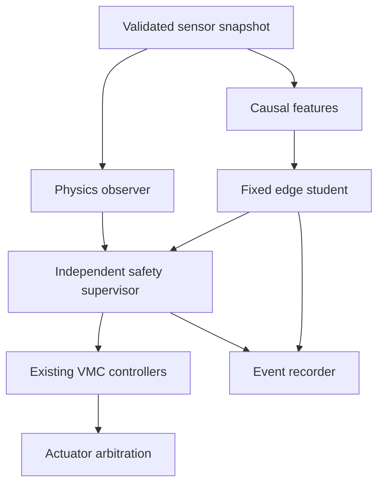
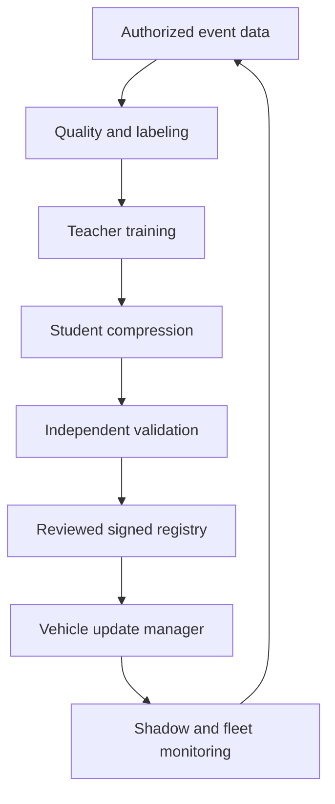

# Architecture

## Vehicle runtime

| Component | Responsibility | Failure behavior |
| --- | --- | --- |
| Data preprocessing/feature SWC | Time alignment, SI conversion, causal windows, validity | Invalidate affected features and reset histories |
| Inference manager | Fixed model execution, static allocation, deadline accounting | Reject late/nonfinite output; do not stall VMC |
| Confidence/OOD SWC | Calibrated confidence, novelty, coverage/excitation checks | Withhold correction |
| Safety supervisor | Independent physical envelopes, gating, diagnostic reason | Select baseline and defined transition policy |
| Model manager | Verified slot, compatibility, atomic activation, version pair | Retain known-good or disable AI |
| Data trigger/health monitor | Bounded ring buffer, event counters, optional upload | Drop logging work before control work |

Deploy AI in a suitably isolated partition with bounded memory, bus/DMA access and runtime budget. ASIL-capable hardware does not make an AI model or QM runtime safety qualified. Verify freedom from interference and shared-resource contention in the ECU safety architecture. Safety supervision runs independently of inference and never depends on a successful AI completion.

Illustrative schedule: control remains at its existing 5/10 ms period; model produces a 10/20 ms result; slow health models run at 100–1000 ms. Use a double-buffered immutable feature snapshot and a timestamped result mailbox. Control reads the latest eligible result without waiting. Avoid dynamic allocation or logging I/O in the control path.

## Cloud learning and delivery

The vehicle gateway/OTA manager handles cloud transport; ZVC does not require a direct Internet connection. Separate data upload from release delivery. Use signed release metadata, authenticated transport, access-controlled training data and a protected vehicle trust anchor. Upload only authorized signals, with bounded event retention and pseudonymous vehicle IDs.

Train on a mixture of instrumented measurements, curated fleet events and AVL VSM simulation. Use teacher outputs as auxiliary labels, with their uncertainty tracked. Simulation and teacher agreement cannot replace independent ground truth. Compile/quantize the student, rerun end-to-end evaluation and publish one approved immutable bundle.
