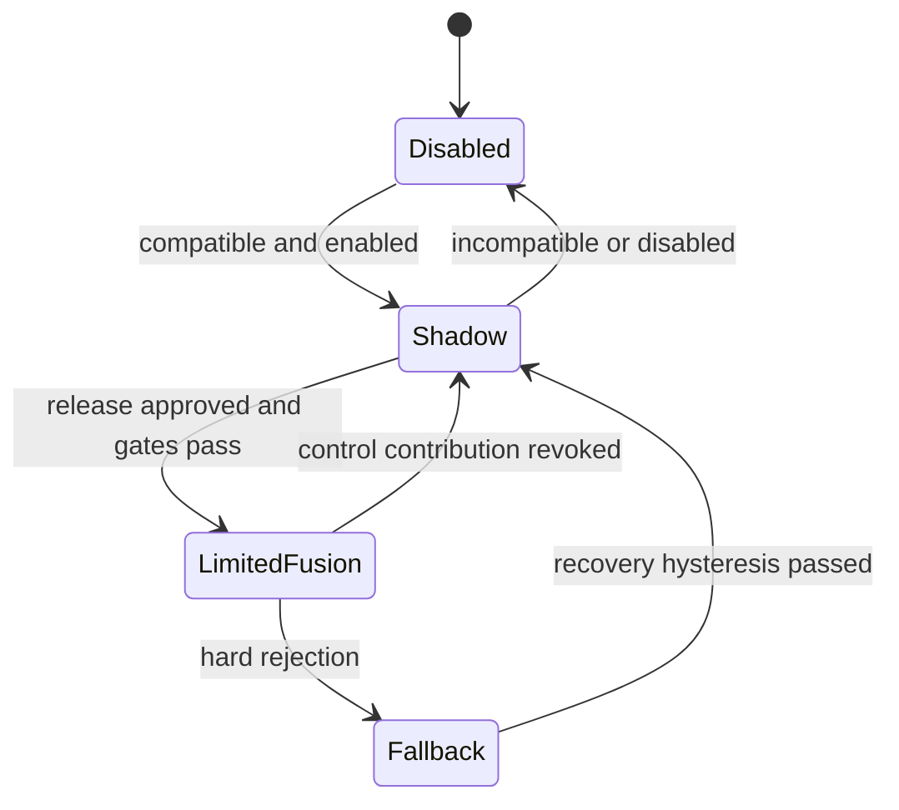

# Safety-bounded corrections

Bounded correction reduces authority but does not by itself prove safety. Define bounds from vehicle hazard analysis, observer uncertainty and closed-loop sensitivity. The baseline must remain validated for the applicable degraded operating conditions.

## Fusion contract

For scalar state x, compute candidate correction c = w * clamp(delta_AI, -b, b), with w in [0, w_max]. Gate w using input freshness/validity, model compatibility, calibrated confidence, OOD, observability, allowed speed/mode/temperature region and independent plausibility. Apply an OEM-approved rate limit to c during normal admission. Set x_final = project(x_physics + c) into a state-dependent physical envelope.

The control runnable rechecks eligibility every cycle. On a hard invalidity, do not keep trusting the cached result: bypass to physics in that cycle. A discontinuity-sensitive controller must have a separately validated bumpless transfer/state-reset strategy. Soft confidence decay may ramp the correction toward zero. The hard-fault policy and transition dynamics are part of closed-loop validation.

An AI calibration may reduce authority within approved bounds. It cannot increase w_max, b, freshness limits or operating envelope beyond the controller-owned safety policy without a formal safety change.

| Quantity | Independent checks and restrictions |
| --- | --- |
| Mu | Excitation and uncertainty gate; class alone cannot authorize upward correction; state-dependent conservative caps |
| Vy/beta | One independent correction; coordinate consistency; beta derived using baseline low-speed policy; innovation and yaw/lateral dynamics consistency |
| Fz[4] | Nonnegative where contact applies; reference-frame and dynamic sum/moment checks; do not force sum(Fz)=mg during vertical acceleration |
| Cf/Cr | Slow update, excitation gate, positive bounded multipliers; freeze in saturation/ABS/ESC unless specifically validated |
| CDC/HAS gains | Select/interpolate only inside approved gain family; actuator stroke/force/thermal protections remain independent |

For Fz, use the existing sign convention and expected dynamic resultant (including gravity projection and body vertical acceleration) and appropriate suspension/contact model. Check residual consistency with roll/pitch moments; a blind four-wheel clipping operation can violate total force and moment balance.

## Operating states

Promotion from shadow is a release decision, not automatic accumulation of confidence. Recovery uses a defined number/time of valid observations, cleared model history and hysteresis. Diagnostics distinguish AI unavailable from baseline-observer failure; the latter uses the existing VMC degradation strategy.

## Worked synthetic bound

Let physics mu=0.60, delta=+0.08, residual cap=0.05 and permitted weight=0.4. If all independent gates pass, candidate correction=0.4×0.05=0.02, giving mu=0.62 before any tighter state-dependent projection. If excitation is insufficient, the result stays 0.60. The numbers demonstrate arithmetic only, not approved friction authority.

Surface class + high confidence + no excitation therefore remains advisory. Even a small optimistic mu bias can alter slip or stability limits; validate directional error costs, not only mean RMSE.
